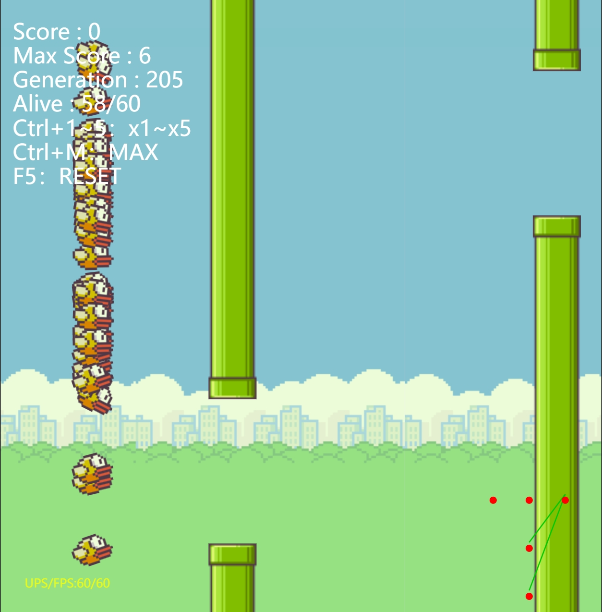

# 包含资源

AI Techniques for Game Programming.pdf

[游戏编程中的人工智能技术].(AI.Techniques.for.Game.Programming).(美)Mat.Buckland.扫描版.pdf

[源代码].[游戏编程中的人工智能技术](AI.Techniques.for.Game.Programming).zip

AI.Techniques.for.Game.Programming source code

AI.Techniques.for.Game.Programming sourcecode

网友根据本书 用rust实现的 人工智能玩愤怒的小鸟

https://planet0104.github.io/neat-flappy-bird/deploy/index.html

